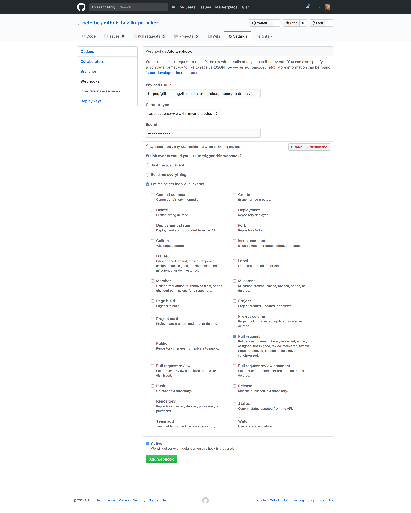

What this is
============

A webhook that can automatically create Bugzilla attachments
when new GitHub Pull Requests are created.

It does this by looking at the git commit message of a newly created PR for a Bugzilla bug
ID in the form "bug n". Then if that bug can be found (and doesn't
already have a link) it creates an attachment which is a link that redirects
to the Pull Request on GitHub.

For Mozilla projects
====================

The code here is just the source code that any organization can use.

There is an instance of this installed on the Mozilla corporate Heroku account
and it's hardwired to use `https://bugzilla.mozilla.org` and the account
set up is exclusive to Mozilla projects using `bugzilla.mozilla.org`.

To use it in your project you need the password. See
[the Mana documentation page](https://mana.mozilla.org/wiki/display/WebDev/GitHub+Bugzilla+PR+Linker).

To get insight into GitHub projects that use this project you can [search by user activity](https://bugzilla.mozilla.org/page.cgi?id=user_activity.html&action=run&from=-14d&who=pulgasaur%40mozilla.bugs) 
which gives you an idea of the projects.

How to use
==========

To enable this you need to go into your GitHub project's **Settings** and
click **Webhooks**. The click the **Add webhook** button (top right corner).

There, type in the the following:

  **Payload URL:** `https://github-bugzilla-pr-linker.herokuapp.com/postreceive`

  **Content type:** `application/x-www-form-urlencoded`

  **Secret:** [See Mozilla Mana page](https://mana.mozilla.org/wiki/display/WebDev/GitHub+Bugzilla+PR+Linker)

  **Which events would you like to trigger this webhook?** Click the
  `Let me select individual events.` option. Check the `Pull request`
  checkbox and uncheck all others.

How to run locally
==================

First create a `.env` file:

    cp .env-dist .env

Edit that `.env` file with real stuff if you have it.

Create a `virtualenv` and install the dependencies:

    pip install -r requirements.txt

Now start it:

    FLASK_DEBUG=1 FLASK_APP=app.app flask run

How to run tests
================

Install the dependencies for running tests:

    pip install -r test-requirements.txt

Run the tests:

    pip install -e .
    FLASK_APP=app.app pytest

How to run with Docker
======================

TODO!

License
=======

[MPL2](http://www.mozilla.org/MPL/2.0/)

Heroku
======

At the moment this Flask app is deployed on Heroku, using the
Mozilla corporate account, under the name
[github-bugzilla-pr-linker](https://dashboard.heroku.com/apps/github-bugzilla-pr-linker).
